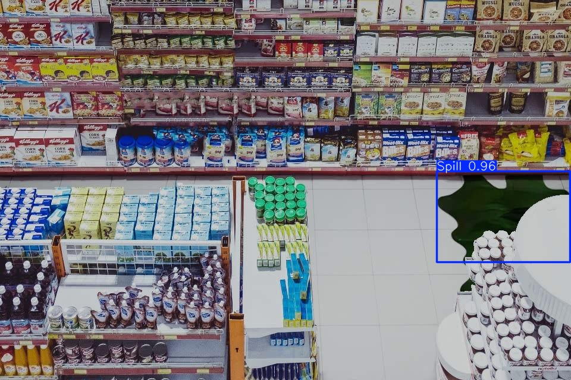
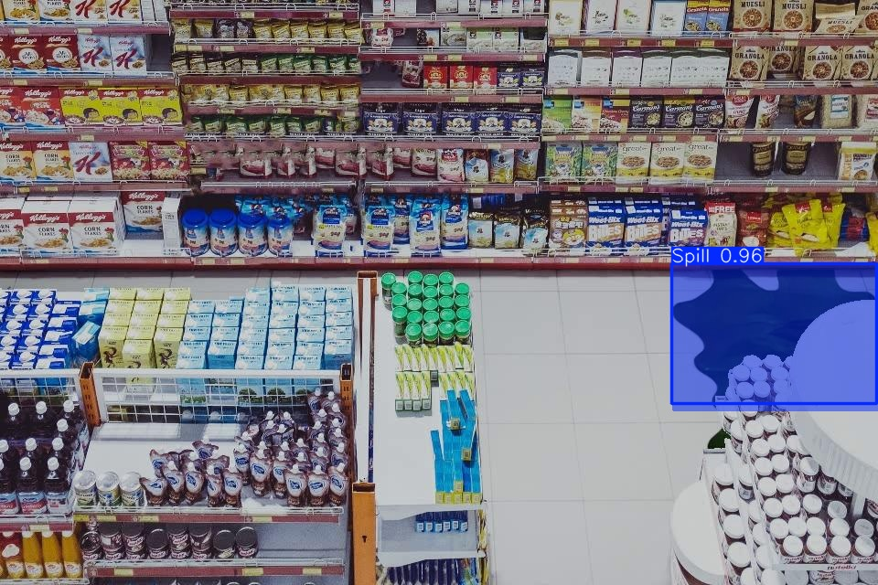
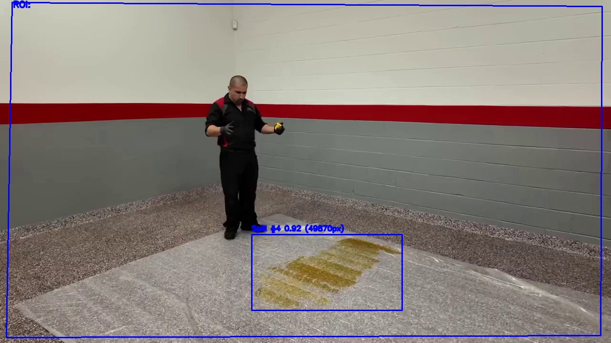
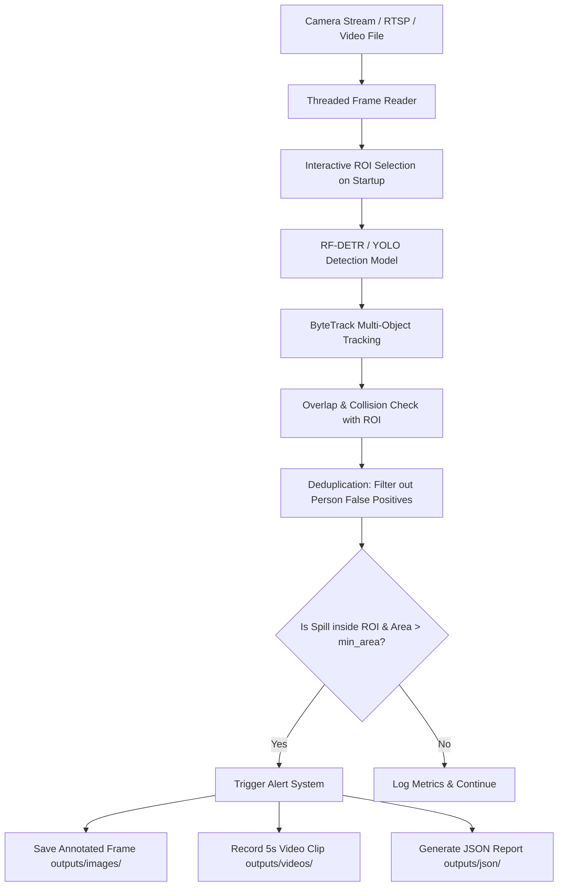

<div align="center">

# 🛢️ **Spill & Leak Detection Engine (RF-DETR)**

### 🚨 Real-Time Oil & Chemical Leak Detection for Industrial CCTV Systems

A **production-grade AI pipeline** built for **real-time CCTV / RTSP monitoring**, combining **RF-DETR Object Detection + ByteTrack tracking + interactive Region of Interest (ROI) filtering** for high-precision alerts.

⚙️ Powered by **Roboflow RF-DETR (Real-Time Detection Transformer)**  
🧠 Integrated with **ByteTrack** for high-accuracy bounding box tracking  
🧩 Part of the **CampNeuron AI Series** — engineered by the **Algosium AI Team**

---

[](#)
[](#)
[](#)
[](#)
[](#)

</div>

---

## 📷 Visual Demonstrations

Here is a preview of the Spill & Leak Detection Engine in action, showing the detection, instance segmentation, and persistent tracking capabilities on actual industrial streams.

<div align="center">
  <table border="0">
    <tr>
      <td align="center"><b>1. Object Detection (RF-DETR)</b></td>
      <td align="center"><b>2. Instance Segmentation Mask</b></td>
    </tr>
    <tr>
      <td></td>
      <td></td>
    </tr>
    <tr>
      <td align="center" colspan="2"><b>3. Real-Time Tracking & ID Assignment (ByteTrack)</b></td>
    </tr>
    <tr>
      <td align="center" colspan="2"></td>
    </tr>
  </table>
</div>

---

## ⚡ Core Stack

| Component | Purpose |
| :--- | :--- |
| 🛢️ **RF-DETR Detection** | Real-time leak bounding box & mask detection using Roboflow Detection Transformer (`Spill`) |
| 🛡️ **Interactive ROI Manager** | Mouse-click polygon drawing window to isolate specific monitoring zones |
| 🎥 **Threaded RTSP Reader** | Low-latency H264/H265 hardware-accelerated GStreamer & RTSP reader |
| 🔁 **ByteTrack Multi-Object Tracking** | Associates bounding boxes across frames to assign unique Track IDs |
| 📝 **JSON Logger** | Auto-saving structured records of detections, track IDs, and pixel area metrics |
| ⚙️ **YAML Config Engine** | Centrally managed settings for camera inputs, thresholds, and outputs |

---

## 🚀 Pipeline Workflow



---

## 🎯 Key Features

* 🛢️ **Real-Time Spill Detection**: Direct integration with the state-of-the-art RF-DETR transformer-based detector for fast and accurate leak localization.
* 🛡️ **Interactive ROI Selector**: Graphically draw polygon boundaries on startup to filter out irrelevant areas (caching coordinates to `config/roi.yaml`).
* 🔄 **On-the-Fly ROI Resetting**: Press `R` on the live window to redraw the ROI on the latest frame without restarting the pipeline.
* ⚡ **ByteTrack Tracking**: Assigns unique track IDs to spills, ensuring consistent tracking across frame sequences.
* 🔁 **Redundancy Filter**: Prevents alert flooding by saving exactly one screenshot, one JSON report, and one video clip per unique track ID.
* 🎥 **Custom Track Recording**: Records a track-specific video clip of configurable length (e.g., 5s) showing bounding boxes when a new spill is detected in the ROI.
* 📂 **Structured JSON Logging**: Saves individual JSON reports and session history tracking timestamps, areas, and confidence metadata for audit trails.
* 🖥️ **Headless GUI Fallback**: Robustly catches display/GUI exceptions on server environments to reuse previously configured ROIs instead of crashing.
* 🏷️ **Track ID Annotation**: Displays track IDs (e.g., `Spill #5`) directly on the live overlay and saved screenshots for easy auditing.
* 👥 **Person Overlap Filtering**: Intelligently bypasses false positive spill alerts that overlap with detected personnel in the scene.

---

## 📊 RF-DETR Benchmark & Comparison

### 1. RF-DETR Architecture Overview
RF-DETR (Roboflow Detection Transformer) is a real-time transformer-based object detection and instance segmentation model. Powered by a **DINOv2 vision transformer backbone**, it solves critical limitations of traditional CNN-based object detectors (like YOLO):
* **No NMS Bottleneck**: End-to-end transformer architecture eliminates Non-Maximum Suppression (NMS) during inference, avoiding latency spikes in crowded scenes.
* **Domain Adaptability**: Evaluated on the rigorous **RF100-VL (100-dataset benchmark)**, RF-DETR shows significantly stronger zero-shot/few-shot generalization and out-of-distribution transfer to complex industrial environments.
* **Receptive-Field Attention**: Global attention mechanisms enable much better detection of irregular, amorphous shapes like liquid spills and leaks compared to rigid bounding-box regression grids.

### 2. RF-DETR Family Performance (NVIDIA T4, TensorRT 10.4, FP16)
| Model Variant | COCO AP (50:95) | Latency (ms) | Parameters (M) | Recommended Use Case |
|---|:---:|:---:|:---:|---|
| **RF-DETR-N** (Nano) | 48.4 | 2.32 | 30.5 | Edge devices, high-fps webcams |
| **RF-DETR-S** (Small) | 53.0 | 3.52 | 32.1 | Standard CCTV, embedded GPUs |
| **RF-DETR-M** (Medium) | 54.7 | 4.52 | 33.7 | Multi-stream RTSP channels |
| **RF-DETR-L** (Large) | 57.2 | 6.80 | 54.2 | High-precision industrial servers |
| **RF-DETR-XL** (XLarge) | 59.1 | 11.40 | 118.0 | Batch offline analysis |
| **RF-DETR-2XL** (2XLarge) | 60.1 | 17.20 | 244.0 | Highest accuracy, non-realtime |

### 3. RF-DETR vs. YOLO Series Comparison
| Feature / Metric | RF-DETR (Medium) | YOLOv8-M | YOLOv10-M | YOLOv11-M |
|---|---|---|---|---|
| **COCO mAP (50:95)** | **54.7%** | 50.2% | 51.3% | 52.5% |
| **RF100-VL (Domain Generalization)** | **Excellent (High AP)** | Fair (Falls on OOD) | Fair | Good |
| **Inference Latency (RTX 4060)** | ~16ms | **~8ms** | ~10ms | ~9ms |
| **Amorphous Shape Handling** | **Excellent (Attention)** | Moderate (BBox regression) | Moderate | Moderate |
| **False Positive Suppression** | **High** (DINOv2 features) | Medium | Medium | Medium |

Why RF-DETR is chosen for this project:
- **Amorphous Shape Detection**: Oil spills have undefined, organic boundaries. Transformers excel at learning shapes without regular grids.
- **Robust Transferability**: Pretrained on DINOv2 self-supervised weights, RF-DETR transfers exceptionally well from training data to novel real-world industrial environments (different floor textures, lighting, reflection, and camera angles).

---

## 📂 Project Structure

```bash
spills/
├── assets/                    # Visual assets for README/documentation
│   ├── spill_detection_demo.jpg
│   ├── spill_segmentation_demo.jpg
│   └── spill_tracking_demo.jpg
│
├── config/
│   ├── config.yaml            # System configurations
│   └── roi.yaml               # Saved polygon coordinates
│
├── models/
│   ├── checkpoint_best_ema(2).pth  # RF-DETR Model Weights (127MB)
│   ├── best.pt                     # YOLOv8 Model Weights (5.4MB)
│   ├── oil_spill_seg.pt            # YOLO Segmentation Weights (23MB)
│   └── yolo26s.pt                  # YOLO Person Weights (20MB)
│
├── outputs/
│   ├── images/                # Saved alert screenshots
│   ├── json/                  # Saved detection report JSON logs
│   └── videos/                # Event-triggered clip recordings
│
├── src/
│   ├── camera/
│   │   └── rtsp_reader.py     # Threaded low-latency RTSP and file frame reader
│   ├── detector/
│   │   └── spill_detector.py  # Model wrapper supporting both YOLO and RF-DETR
│   ├── roi/
│   │   └── roi_manager.py     # Interactive manual ROI selector & polygon collision
│   ├── visualization/
│   │   └── draw_results.py    # Overlays drawing, masks, text annotations
│   ├── output/
│   │   ├── save_image.py      # Image saving utilities
│   │   ├── save_video.py      # Video saving utilities
│   │   └── save_json.py       # JSON report and session serialization
│   └── utils/
│       ├── logger.py          # Formatted rotating file logging
│       └── helpers.py         # Config loading helper utilities
│
├── tests/
│   ├── test_inference.py      # Unit tests for inference, ROI, and models
│   └── rfdetr_test.py         # Simple live RF-DETR test script
│
├── main.py                    # Application entry point
├── requirements.txt           # Python package dependencies
└── README.md                  # This file
```

---

## ⚙️ Configuration

All system behavior is controlled via [config.yaml](file:///home/vivek/Downloads/spills/config/config.yaml). No code changes needed.

```yaml
model:
  weights: "models/checkpoint_best_ema(2).pth" 
  person_weights: null                   
  device: "cuda"                         
  imgsz: 640                           
  conf: 0.45                        
  iou: 0.45                            
  classes:
    0: Spill

postprocess:
  min_area_px: 500

visualization:
  show_preview: true                   
  preview_scale: 0.75
  mask_alpha: 0.4
  colors:
    Spill: [255, 0, 0]                   

camera:
  mode: "stream"  
  source: "1.mp4" 
  fps_limit: 25
  width: 1280
  height: 720

output:
  image_dir: "outputs/images"         
  video_dir: "outputs/videos"          
  json_dir: "outputs/json"             
  video_duration_sec: 5
```

---

## 🚀 Installation

Ensure your conda environment is activated, then install dependencies:

```bash
git clone https://github.com/vivek97vivu/Spill_detction.git
cd Spill_detction

# Activate your conda environment (e.g., spill)
conda activate spill

# Install required dependencies
pip install -r requirements.txt
pip install rfdetr
```

### Requirements

* NVIDIA GPU (CUDA support recommended)
* CUDA 12.x / 13.x
* OpenCV with GStreamer support (optional, for low-latency RTSP pipelines)
* Python 3.10+
* `rfdetr` package and its dependencies (`supervision`, `transformers`, etc.)

---

## ▶️ Running the Engine

Start the main pipeline:

```bash
python main.py
```

---

## 🎥 Preview Window Controls

| Key | Action |
|---|---|
| `q` / `Q` / `ESC` | Quit the application |
| `r` / `R` | Reset and redraw the Region of Interest (ROI) on-the-fly |
| `ENTER` / `SPACE` | Save ROI and start processing (during interactive ROI setup) |

---

## 🚨 Alert System Workflow

### Stage 1 — Detection & Tracking
* **RF-DETR** detects spill bounding boxes, and **ByteTrack** maintains consistent tracking IDs across frame sequences.
* Simultaneously, if person weights are active, the pipeline detects people in the scene and bypasses false alarm spills that overlap with people.

### Stage 2 — ROI Intersection & Filtering
If the detected spill box intersects with your custom ROI boundary and exceeds `min_area_px`:
* **Image Alert**: Saves a high-quality annotated JPEG showing the first appearance of the spill to `outputs/images/` (exactly once per track ID, named `spill_track_{track_id}_{timestamp}.jpg`).
* **Video Alert**: Starts recording a `video_duration_sec` track-specific video clip showing the incident to `outputs/videos/` (exactly once per track ID, named `spill_track_{track_id}_{timestamp}.mp4`).
* **JSON Log**: Saves an individual JSON report detailing the incident to `outputs/json/` (exactly once per track ID, named `spill_track_{track_id}_{timestamp}.json`).

---

## 📸 Output Artifacts

| Folder | Contents |
|---|---|
| [outputs/images/](file:///home/vivek/Downloads/spills/outputs/images/) | Detection screenshots (saved exactly once per track ID) |
| [outputs/videos/](file:///home/vivek/Downloads/spills/outputs/videos/) | Event-triggered video clips containing overlays |
| [outputs/json/](file:///home/vivek/Downloads/spills/outputs/json/) | Serialized detection logs containing pixel area, track IDs, and timestamps |

---

## ⚡ Inference & Pipeline Latency

| Metric | Value |
|---|---|
| RF-DETR Inference Latency | ~16–18ms (on RTX 4060 GPU with optimization) |
| Post-processing & ROI Check | ~1–2ms |
| RTSP Read Latency | Thread-separated, frame-drop policy (0ms block on main loop) |
| GPU Memory Footprint | ~1.5 GB to 2.5 GB (depending on resolution) |

---

## 🧪 Engineering Decisions

| Decision | Reason |
|---|---|
| **Interactive ROI Selection** | CCTV streams contain static areas (buildings, skies) that never leak; ROI limits false alerts. |
| **ByteTrack Tracking** | Leverages Supervision's high-performance tracker to ensure that multiple spills are cleanly separated and unique alerts are sent. |
| **Inference Optimization** | Compiles the PyTorch transformer graph using TorchScript trace / ONNX optimization for faster inference on GPU. |
| **Per-ID Deduplication** | Keeps alert directories clean by avoiding flood-saving the same leak every frame, enforcing exactly one image, one JSON report, and one video clip per spill track ID. |
| **Threaded RTSP Reader** | Runs frame reading in a background thread to prevent GUI lagging and buffer accumulation. |
| **JSON Logger** | Keeps a machine-readable audit trail of leaks, track IDs, and pixel areas. |
| **On-the-Fly ROI Reset** | Allows security operators to adjust monitoring boundaries live without restarting the pipeline. |
| **Headless GUI Fallback** | Prevents pipeline crashes in remote or automated headless server runs by gracefully catching GUI display errors and reusing loaded config. |
| **Person Bypass Filter** | Filters out spills that overlap with detected persons to avoid false positive spill triggers caused by people or their shadows. |

---

## 🔮 Future Enhancements

* 📧 Email/Slack notification integration on detection events
* ☁️ Cloud storage synchronization (AWS S3) for alerts
* 🌐 Web dashboard for multi-camera visualization
* 📊 Real-time leakage area growth-rate graph visualization

---

<div align="center">
Engineered by the <b>Algosium AI Team</b> · CampNeuron AI Series
</div>
